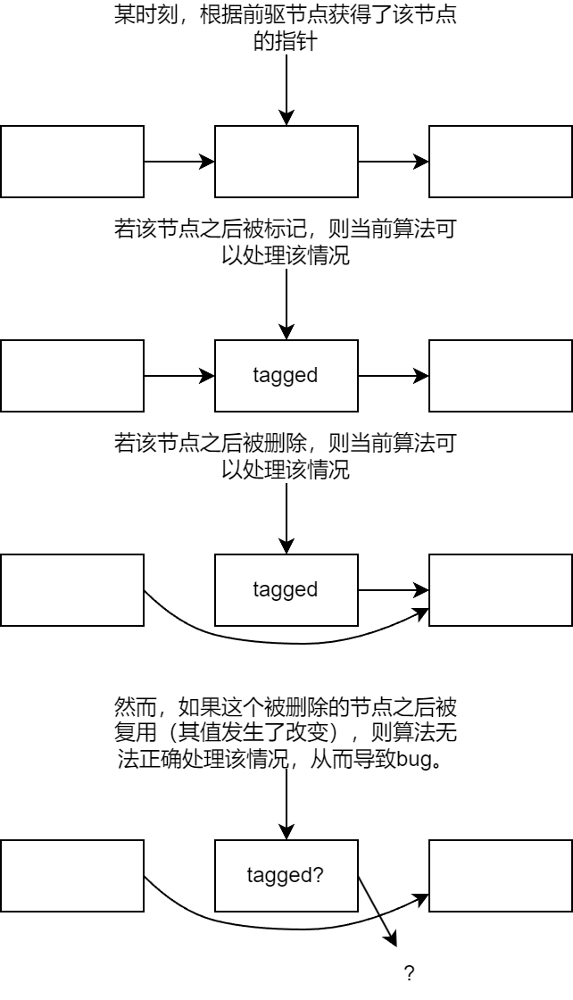
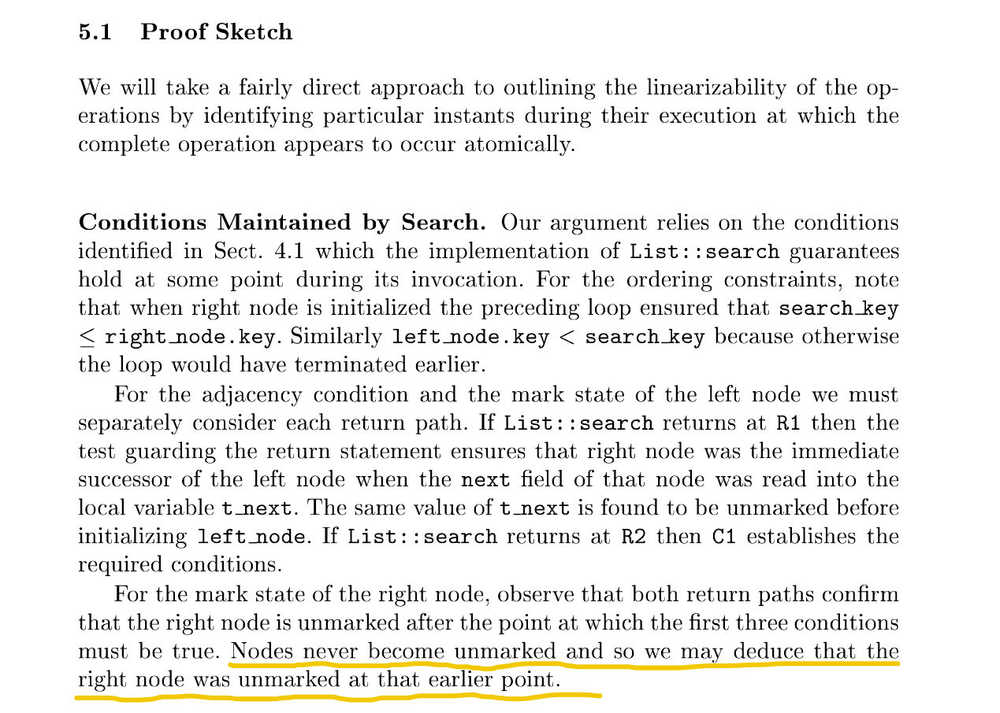
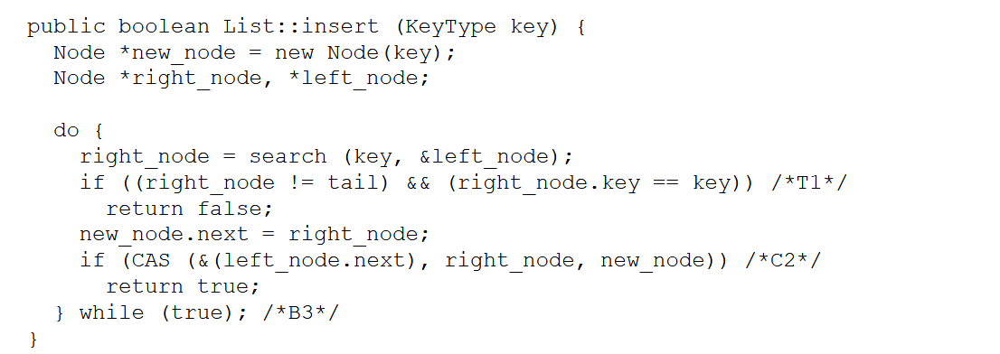
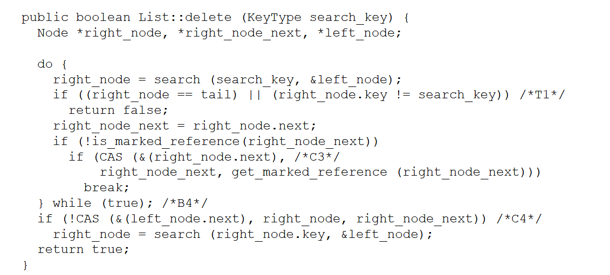

# 无锁链表当前bug描述

## 描述

在commit `eb5129fd79434e2ec426d0a434e894cfc1ac5aae`版本中，对堆分配器进行性能测试，或者执行新增的堆分配器测例中的某些，均会发生运行错误，主要有**访存错误**和**`unwarp`一个`None`值**这两种错误形式。

经过排查后发现，bug的触发条件为**并行地对堆进行多次`push`或`pop`操作**。

## 原因

该bug的产生原因已经明确。原因为**被删除的链表节点被复用，导致链表操作取到脏数据**。

如上图所示，如果被删除的节点被复用（且数据被更改），则算法无法处理该情况，其原因有二：

1. 更改后的数据（很可能）没有标记，从而使算法无法判断出该指针无效。
2. 更改后的数据（很可能）不再指向原链表，使算法的遍历链表过程无法继续。（算法的遍历链表操作依赖于被删除的节点仍指向原链表）

在链表论文的原文中，也提到了该链表的正确性依赖于**被标记的节点不会被取消标记**。实际上，如果要求链表完全可靠，则被删除的节点不能被复用，而应永远保持它们的值（也就是删除标记+指向原链表的指针），实际上也相当于将这部分内存泄漏了。

原文的代码也是这么写的：创建节点时，`new`了`Node`对象，但删除节点时，没有`delete`它。

然而，这样的内存泄漏是堆分配器不可接受的。

## 解决方案？

对于该问题，我还没有想出有效的解决方案。以下是一些思路，可能在进一步修改后，可以得到可行的思路，因此我将它们记下。

将问题分为严重、中等、轻微三类。

- 严重：导致逻辑错误仍然发生的问题
- 中等：导致可靠性降低的问题
- 轻微：性能上的问题

### 1. 将指针所在的内存区域保留在堆分配器内部

例如：需要1个`usize`的空间，则堆分配器申请2个`usize`的空间`space: [usize; 2]`，其中`space[0]`保留在堆分配器内部，不向外提供；`space[1]`提供给外界。从而使`space[0]`中存储的指针和标记不变。

**问题：** 

1. **（严重）** 即使在分配后保持不变，但在回收这部分空间时，`space[0]`的值仍会变化（且一定会清除删除标记）。因此，不能完全解决以上的bug。
2. **（轻微）** 造成了空间的浪费（尤其在分配小内存时）

### 2. 用版本字段替代已删除字段

当要标记某个节点为已删除时、或者复用一个已删除的节点时，增加该节点的版本字段。这样，算法就可以识别出已删除且已复用的节点。

**问题：** 

1. **（严重）** 将该内存分配给外界时，版本字段仍会遭到破坏
2. **（严重）** 已删除且已复用的节点的指针部分仍被破坏了
3. **（中等）** 版本字段需要和指针放在一个可被原子操作的内存单元中，因此版本字段可以使用的只有指针字段因为对齐而不使用的后三位，导致版本只能取8个值，可靠性也不高

### 3. 结合1和2

既保持指针所在的`usize`区域不分配给外界，又使用版本字段替换删除标记。

**问题：**

1. **（严重）** 方法2的问题2、3依然存在
2. **（严重）** 在进行区域的切分和合并时，合并会导致靠后区域的指针成为可分配的内存，再将该区域不切分地分配出去，即会导致该指针被分配给外界

### 4. 改为非嵌入式链表

使用单独的内存空间存储链表节点，链表节点通过指针指向要分配的内存区域。通过该方式，链表节点所在内存空间不会分配给外界，从而更好地管理其中的内容。

**问题：**

1. **（严重）** 节点被回收复用时的bug仍存在。且节点的回收时机由释放时变为了分配时。因此，与嵌入式链表相同，都会在分配时产生bug。
2. **（轻微）** 空间浪费较多，例如最极端的情况，管理一个8字节的内存空间，需要额外的16字节的节点。

### 5. 高位打tag

似乎与低位打tag并无什么本质上的区别？因为链表数据更新时，仍会覆盖掉tag。

### 6. 增加引用计数字段

为每个链表节点增加引用计数字段。当线程正在访问该节点时，增加计数；当线程不再访问该节点时，降低计数。

引用计数不会阻止并发访问。仅在`pop`和`delete`函数的末尾，如果取到的节点的引用计数>1，则函数需要循环等待直到引用计数=1（说明只有当前线程在访问该节点）。

引用计数字段放在指针（及标记）字段之后，占用一个`usize`的空间。这样设计是为了使引用计数的不同不会导致CAS操作失败。当只有引用计数变化了时，CAS操作应该成功，就像没有引用计数时的情况一样。

**问题：**

1. **（中等）** 从取到某个节点的指针，到通过该指针增加对应节点的引用计数，中间仍有一段不长的时间间隔。存在一种可能，在取到节点的指针之后、增加节点的引用计数之前，该节点被另一线程`delete`或`pop`成功，导致错误。
2. **（中等）** 该方法为`delete`和`pop`函数引入了忙等。不过，忙等发生在函数的末尾，此时除了将要作为返回值的节点外，函数不会持有其它节点的引用计数。因此，这类“不持有资源的忙等”应该不会导致死锁？
3. **（轻微）** 该方法导致最小内存块的大小从8字节变为16字节，因此在分配8字节空间时会造成更多的浪费。不过，与所述的其它几种方法相比，该方法的空间浪费很小。
