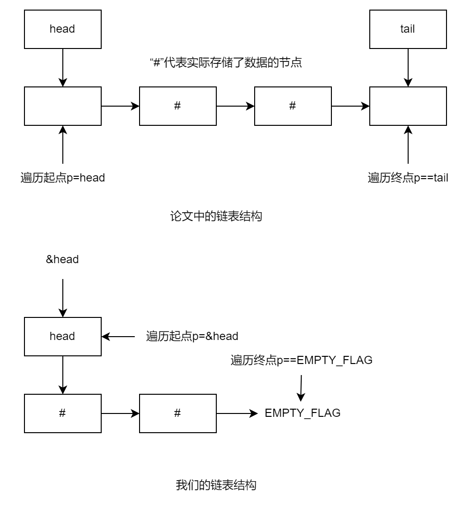

# 无锁链表论文阅读及修改方案

## 无锁链表论文的设计

解决的问题：CAS操作无法保证在链表节点删除过程中，被删除元素的指针依然指向新的链表头。


因此，将删除操作分为两段：先在删除节点上增加“删除标记”（逻辑删除），再执行指针修改操作（物理删除）


插入和删除都会使用`search`函数，其在搜索过程中还会物理删除具有删除标记的节点，从而避免执行删除操作的线程被抢占而无法及时物理删除造成的死锁。

## 论文的实现

### `search`函数

```C
private Node *List::search(KeyType search_key, Node **left_node) {
    Node *left_node_next, *right_node;
    search_again:
    do {
        Node *t = head;
        Node *t_next = head.next;
        /* 1: Find left_node and right_node */
        do {
            if (!is_marked_reference(t_next)){
                (*left_node) = t;
                left_node_next = t_next;
            }
            t = get_unmarked_reference(t_next);
            if (t == tail) break;
            t_next = t.next;
        } while(is_marked_reference(t_next) || (t.key < search_key));/*B1*/
        right_node = t;
        /* 2: Check nodes are adjacent*/
        if (left_node_next == right_node)
            if ((right_node != tail) && is_marked_reference(right_node.next))
                goto search_again; /*G1*/
            else
                return right_node; /*R1*/
        /* 3: Remove one or more marked nodes */
        if (CAS(&(left_node.next), left_node_next, right_node))/*C1*/
            if ((right_node != tail) && is_marked_reference(right_node.next))
                goto search_again; /*G2*/
            else
                return right_node; /*R2*/
    } while (true); /*B2*/
}
```

首先，该链表为从小到大的有序链表，因此查找到的位置为`left_node`满足`left_node`是小于`search_key`的最后一个元素，而返回的位置`right_node`是大于等于`search_key`的第一个元素。

函数的结构分为三段，位于一个循环中。

（注：后文出现以符号代表节点的情况，均指它们作为指针指向的节点。）

第一段（Find left_node and right_node）：

- 通过两个相邻指针`t`和`t_next`在链表上移动，直到`t`是大于等于`search_key`的第一个节点，且`t`指向的节点未被标记。\*1`t`和`t_next`保持相邻（除非`t`位于链表尾，则`t` == `t_next`）。
- 在循环中更新`left_node`和`left_node_next`：如果`t`指向的节点的前驱未被标记\*2、，则将`left_node`和`left_node_next`更新为上一次循环的`t`和`t_next`值。
- 循环结束后，将`right_node`赋值为`t`。

\*1：代码中写的是`t_next`未被标记。因为其含义是`t_next`的值未被标记，也就是`t`指向的节点（其指针的值为`t_next`）未被标记。

\*2: 代码中写的是`t_next`未被标记，根据\*1，其含义为`t`指向的节点未被标记。但此时的`t`和`t_next`还未更新，因此站在被循环更新后的变量的角度看，被标记的节点为`t`指向的节点的前驱的。

通过这一过程，各个指针的关系如下：

1. 若待寻找的节点（即小于`search_key`的最后一个节点）不是尾部、不是被标记的节点的前驱、不是被标记节点：`left_node == 待寻找的节点 => left_node_next == right_node == 返回的节点 == t => t_next`
2. 若待寻找的节点是尾部：`left_node == 待寻找的节点 => left_node_next == right_node == 返回的节点 == t == t_next`
3. 若待寻找的节点是被标记的节点的前驱：`left_node == 待寻找的节点 => left_node_next == 被标记的节点 => right_node == t => t_next`
4. 若待寻找的节点是被标记的节点：`left_node => left_node_next == 被标记的节点 == 待寻找的节点 => right_node == t => t_next`

第二段（Check nodes are adjacent）：

外层if筛选出了情况1、2。

内层if：如果`right_node`不是尾部，且`right_node`被标记，则重新寻找（注：这次重新寻找，若标记仍未删除则会进入情况4）。否则，直接返回`right_node`。

第三段（Remove one or more marked nodes）：

进入第三段的只有情况3、4。

首先在外层if中使用CAS，判断如果`left_node`的后继是`left_node_next`（即，`left_node`和`left_node_next`间未插入新节点，且`left_node_next`未被删除），则将`left_node`的后继设置为`right_node`。（即，删除了被标记的`left_node_next`）

如果删除失败，则重新查找（通过`while`循环实现）。

如果删除成功，进入内层if，功能与第二段的内层if相同。

### `find`函数

```C
public boolean List::find(KeyType search_key) {
    Node *right_node, *left_node;
    right_node = search(search_key, &left_node);
    if((right_node == tail) ||
        (right_node.key != search_key))
        return false;
    else
    return true;
}
```

### `insert`函数

```C
public boolean List::insert(KeyType key) {
    Node *new_node = new Node(key);
    Node *right_node, *left_node;
    do{
        right_node = search(key, &left_node);
        if ((right_node != tail)&&(right_node.key == key)) /*T1*/
            return false;
        new_node.next = right_node;
        if (CAS(&(left_node.next), right_node, new_node))/*C2*/
            return true;
    } while (true);/*B3*/
}
```

论文的链表是一个有序且元素互不相同的链表，因此需要查找插入位置，且链表中已有相同元素时会报插入失败。

### `delete`函数

```C
public boolean List::delete(KeyType search_key) {
    Node *right_node, *right_node_next, *left_node;
    do {
        right_node = search(search_key, &left_node);
        if ((right_node == tail) || (right_node.key != search_key)) /*T1*/
            return false;
        right_node_next = right_node.next;
        if (!is_marked_reference(right_node_next))
            if (CAS(&(right_node.next), /*C3*/ right_node_next, get_marked_reference(right_node_next)))
                break;
    } while (true);/*B4*/
    if (!CAS(&(left_node.next), right_node, right_node_next)) /*C4*/
        right_node = search(right_node.key, &left_node);
    return true;
}
```

如论文所示，链表项删除分为两个步骤。

1. 找到要删除的链表项，使用CAS标记它。其中，如果找不到链表项，则提前返回；如果找到的项已有标记，或者CAS操作失败，则重新寻找要删除的项。否则，进入第二步。
2. 对要删除链表项的前驱做CAS操作，修改其next指针。如果CAS操作失败，则执行search函数，对要删除的项再进行搜索，从而使用search函数删除已被标记的待删除项。

## 我们链表的修改方案

根据堆分配器的使用情况，决定如此设计链表的接口：

`push`：将一项插入到链表头。

`pop`：从链表头删除一项，并返回其内容。

`delete`：从链表中删除指定的一项。

`is_empty`：判断链表是否为空。

<!-- `iter`：返回对链表的不可变迭代器。工作量太大，暂不实现 -->

与原有接口相比，删除了迭代器，其功能改为使用`delete`实现。

此外，我们的链表和论文的链表还有一个不同：

论文的链表中，`head`和`tail`都是指向两个空节点的指针，这两个空节点之间才是存储实际数据的节点。但我们的链表没有`tail`指针，而`head`直接指向存储实际数据的第一个节点。

为了最大程度地保持我们链表与论文链表的相似性，我们将我们链表数据结构的`head`字段视为第一个链表节点。这样的设计也可以使`head`字段和链表节点一样使用位置无关地址和原子操作。

因此，论文中的`head`对应我们的`&head`，论文中的`tail`对应我们的`EMPTY_FLAG`，如下图所示。



由于我们的链表与论文的链表在接口、排列上不尽相同，因此以下描述各个接口的实现：

### `push`函数

```Rust
/// Push `item` to the front of the list
/// SAFETY: item需要指向一个有效的内存地址
pub unsafe fn push(&self, item: *mut ()) {
    loop {
        let (left_node, right_node) = self.get_headptr_head();
        let new_node = NodePtr::from_value(item);
        new_node.pointed_node().set(right_node.linked_value());
        if left_node.pointed_node().compare_exchange(right_node.linked_value(), new_node.linked_value()).is_ok() {
            return;
        }
    }
}
```

`item`指链表项携带的信息，也就是空闲块的首地址（链表首地址）。因此，`item`同时也是指向链表项的指针。

### `pop`函数

```Rust
/// Try to remove the first item in the list
pub fn pop(&self) -> Option<*mut ()> {
    let mut left_node = NodePtr::default();
    let mut right_node = NodePtr::default();
    let mut right_node_next = NodePtr::default();
    loop {
        // 查找与逻辑删除
        loop {
            (left_node, right_node) = self.get_headptr_head();
            if right_node.value() == EMPTY_FLAG {
                return None;
            }
            right_node_next = right_node.next();
            if !right_node_next.is_marked() { // 此处实际判断的是right_node节点是否被标记
                if right_node.pointed_node().compare_exchange(right_node_next.linked_value(), NodePtr::from_value(right_node_next.mark()).linked_value()).is_ok() {
                    break;
                }
            }
        }
        // 物理删除
        if left_node.pointed_node().compare_exchange(right_node.linked_value(), right_node_next.linked_value()).is_err() {
            let (_, _) = self.search_with_ptr(right_node.value());
            // 之后回到大循环，因为需要重新pop一项出来
        }
        else {
            assert!(!right_node.is_marked());
            return Some(right_node.value())
        }
    }
}
```

`right_node`即为指向弹出块的指针，也是获取的空闲块的首地址

### `delete`函数

```Rust
/// 从链表中查找指针所指的项并删除。
/// 虽然没有显式地返回被删除的项，但算法保证每个项只会被删除一次，且函数返回时该项一定已被删除。
/// 因此，可以认为调用该函数后，线程就拥有了被删除项。
/// 返回值true代表链表中有所找项并成功删除；false代表没有所找项。
/// 不会出现链表中有所找项但删除失败的情况。
pub fn delete(&self, item: *mut ()) -> bool {
    let mut left_node = NodePtr::default();
    let mut right_node = NodePtr::default();
    let mut right_node_next = NodePtr::default();

    // 查找与逻辑删除
    loop {
        (left_node, right_node) = self.search_with_ptr(item);
        if right_node.value() == EMPTY_FLAG {
            return false;
        }
        right_node_next = right_node.next();
        if !right_node_next.is_marked() { // 此处实际判断的是right_node节点是否被标记
            if right_node.pointed_node().compare_exchange(right_node_next.linked_value(), NodePtr::from_value(right_node_next.mark()).linked_value()).is_ok() {
                break;
            }
        }
    }
    // 物理删除
    if left_node.pointed_node().compare_exchange(right_node.linked_value(), right_node_next.linked_value()).is_err() {
        let (_, _) = self.search_with_ptr(right_node.value());
    }
    return true;
}
```

### `search_with_ptr`函数

注意：此函数的意义与论文的`search`有所不同。论文的`search`是按值查找，而此处的`search_with_ptr`为按指针查找。进行这样的修改，是因为一般的链表存储的信息在链表项之中，而我们的链表存储的信息是链表项的地址。这也保证了，两种链表项中存储的信息都是不可修改的。

```Rust
fn search_with_ptr(&self, item: *mut ()) -> (NodePtr, NodePtr) { // 两个返回值分别为left_node和right_node
    let mut left_node: NodePtr = NodePtr::default();
    let mut left_node_next: NodePtr = NodePtr::default();
    let mut right_node: NodePtr = NodePtr::default();
    loop {
        loop {
            let mut t: NodePtr = NodePtr::from_value(&self.head as *const ListNode as *mut ListNode as *mut ());
            let mut t_next: NodePtr = self.head.marked_ptr();

            /* 1: Find left_node and right_node */
            loop {
                if !t_next.is_marked() {
                    left_node = t;
                    left_node_next = t_next;
                }
                t = NodePtr::from_value(t_next.unmark());
                if t.value() == EMPTY_FLAG {
                    break;
                } 
                t_next = t.next();
                // rust没有do-while，因此这样退出循环
                if !(t_next.is_marked() || (t.ptr() != item)) { // if的第二个条件，将原论文的按值查找改为了按指针查找
                    break;
                }
            }
            right_node = t;

            /* 2: Check nodes are adjacent*/
            if left_node_next.value() == right_node.value() {
                if (right_node.value() != EMPTY_FLAG) && right_node.pointed_node().is_marked() {
                    break;
                }
                else {
                    return (left_node, right_node);
                }
            }
            
            /* 3: Remove one or more marked nodes */
            if (left_node.pointed_node().compare_exchange(left_node_next.linked_value(), right_node.linked_value())).is_ok() {
                if (right_node.value() != EMPTY_FLAG) && right_node.pointed_node().is_marked() {
                    break;
                }
                else {
                    return (left_node, right_node);
                }
            }
        }
    }
} 
```

### `get_headptr_head`函数

该函数为`search_with_ptr`函数的变体，用于为`push`和`pop`函数获取对应的`left_node`和`right_node`（即为`&mut head` 和 `head`）。该函数还会像`search_with_ptr`函数一样清理已标记节点，从而保证`left_node`和`right_node`符合要求。

该函数对`search_with_ptr`函数的修改仅有，在1阶段的循环继续条件中删除了`t != item`，从而使一阶段的循环仅用于跳过被标记的节点。

```Rust
fn get_headptr_head(&self) -> (NodePtr, NodePtr) { // 两个返回值分别为&head和head
    let mut left_node: NodePtr = NodePtr::default();
    let mut left_node_next: NodePtr = NodePtr::default();
    let mut right_node: NodePtr = NodePtr::default();
    loop {
        loop {
            let mut t: NodePtr = NodePtr::from_value(&self.head as *const ListNode as *mut ListNode as *mut ());
            let mut t_next: NodePtr = self.head.marked_ptr();

            /* 1: Find left_node and right_node */
            loop {
                if !t_next.is_marked() {
                    left_node = t;
                    left_node_next = t_next;
                }
                t = NodePtr::from_value(t_next.unmark());
                if t.value() == EMPTY_FLAG {
                    break;
                } 
                t_next = t.next();
                // rust没有do-while，因此这样退出循环
                if !t_next.is_marked() { // if的第二个条件，将原论文的按值查找改为了按指针查找
                    break;
                }
            }
            right_node = t;

            /* 2: Check nodes are adjacent*/
            if left_node_next.value() == right_node.value() {
                if (right_node.value() != EMPTY_FLAG) && right_node.pointed_node().is_marked() {
                    break;
                }
                else {
                    return (left_node, right_node);
                }
            }
            
            /* 3: Remove one or more marked nodes */
            if (left_node.pointed_node().compare_exchange(left_node_next.linked_value(), right_node.linked_value())).is_ok() {
                if (right_node.value() != EMPTY_FLAG) && right_node.pointed_node().is_marked() {
                    break;
                }
                else {
                    return (left_node, right_node);
                }
            }
        }
    }
} 
```

### `is_empty`函数

直接判断`head`的值的话，则当表中只有被标记的节点时，会引起误判。因此使用`get_headptr_head`实现。

```Rust
/// Return `true` if the list is empty
pub fn is_empty(&self) -> bool {
    let (_, right_node) = self.get_headptr_head();
    return right_node.value() == EMPTY_FLAG;
}
```

### 指针类型

设计两种指针类型，分别代表存储在堆上、被各个线程访问的链表节点`ListNode`（有标记、地址无关、原子操作）和线程内部临时使用的自由指针（有标记、非地址无关、非原子操作）`NodePtr`。

当使用`ListNode`代表节点时，指的是`ListNode`自身所在的节点；当使用`NodePtr`代表节点时，指的是`NodePtr`作为指针指向的节点。

```Rust
/// 该类型代表一个链表节点。
/// 其值可以看作一个可能带有标记的、地址无关的、原子的指针。
pub(crate) type ListNode = MarkedPtr<PIPtr<AtomicPtr<()>>>;

/// 该类型代表指向链表节点的指针（且指针自身的位置不在链表上）。
/// 其与有效指针的唯一区别是其可能带有标记。
pub(crate) type NodePtr = MarkedPtr<*mut ()>;
```

`MarkedPtr`、`PIPtr`、`AtomicPtr<()>`均实现了一个trait，代表各种指针操作和CAS

```Rust
pub(crate) trait LinkedPtr {
    /// 获取该节点的值，没有进行去标记和地址转换
    fn value(&self) -> *mut ();
    /// 获取该节点的值，且经过了某种将值变为有效的指针的转换。
    /// 最外层类型的ptr函数的返回值可以直接作为指针访问内存地址。
    fn ptr(&self) -> *mut ();
    /// 新建节点，直接将传入的值存入节点。
    fn from_value(value: *mut ()) -> Self;
    /// 新建节点，认为传入的值是指针，对其做ptr函数内变换的逆变换后存入节点。
    fn from_ptr(ptr: *mut ()) -> Self;
    /// 将指向该节点的指针转换为对该节点的引用
    /// 该函数中不需要地址转换，因为其不涉及将指针存储入节点。
    fn from_its_ptr(its_ptr: *mut ()) -> &'static Self;
    /// 修改该节点存储的值
    fn set(&self, value: *mut ());
    /// 对该节点存储的值做CAS操作
    fn compare_exchange(&self, current: *mut (), new: *mut ()) -> Result<*mut (), *mut ()>; // 这里的参数视为value

    /// 根据默认值（EMPTY_FLAG）新建节点
    fn default() -> Self
    where Self: Sized {
        Self::from_value(EMPTY_FLAG)
    }
    /// 判断两个节点的值是否相等
    fn eq(&self, other: &Self) -> bool {
        self.value() == other.value()
    }
    /// 获取该节点作为指针指向的下一个节点的引用
    fn next(&'static self) -> &'static Self {
        Self::from_its_ptr(self.ptr())
    }
}
```

对`LinkedPtr`的操作大部分是按值操作（没有进行去标记和地址转换），只有少数情况下需要进行按指针操作（进行了去标记和地址转换）：

1. 在`search`第一阶段的开始，使用&mut head赋值t。
2. 使用指针访问下一个节点

此外，`MarkedPtr`还支持更多操作：

```Rust
impl<T> MarkedPtr<T>
where T: LinkedPtr {
    /// 判断自身是否有标记
    pub fn is_marked(&self) -> bool;

    /// 返回自身被标记后的值，不改变自身
    pub fn mark(&self) -> *mut ();

    /// 返回自身去掉标记后的值，不改变自身
    pub fn unmark(&self) -> *mut ();

    /// 获取该节点的值，且经过了地址变换。
    /// 返回值与有效指针的唯一区别是返回值可能带有标记。
    pub fn marked_ptr(&self) -> MarkedPtr<*mut ()>;
}
```

而对于`NodePtr`类型，除了几个与标记相关的操作外，还支持这些操作：

```Rust
impl MarkedPtr<*mut ()> {
    /// 获取指针指向的下一个节点的指针
    /// 与ListNode::next不同，该函数还包含将ListNode转化为NodePtr的过程。
    pub fn next(&self) -> Self {
        self.pointed_node().marked_ptr()
    }

    pub fn pointed_node(&self) -> &ListNode {
        ListNode::from_its_ptr(self.ptr())
    }

    /// 将指针转化为链表上存储的位置无关形式
    pub fn linked_value(&self) -> *mut () {
        if self.unmark() == EMPTY_FLAG {
            self.value()
        }
        else {
            unsafe { (self.value() as usize - get_data_base()) as *mut () }
        }
    }
}

```